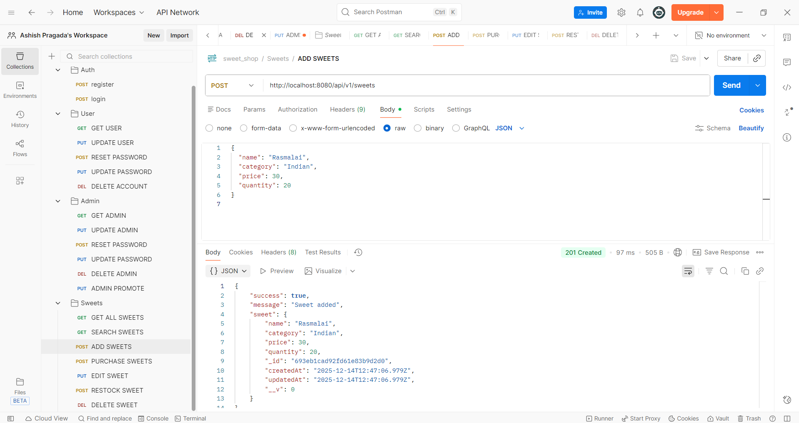
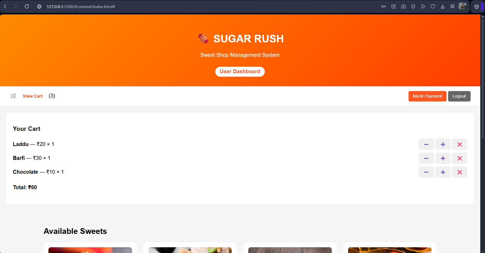
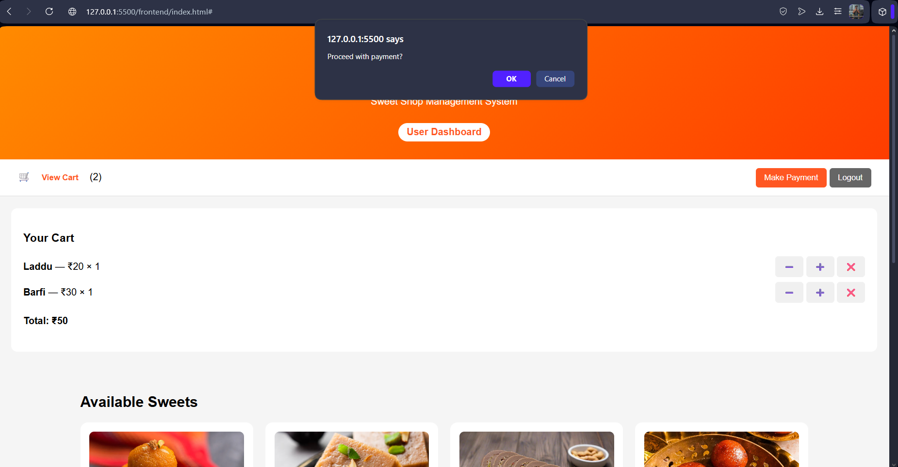
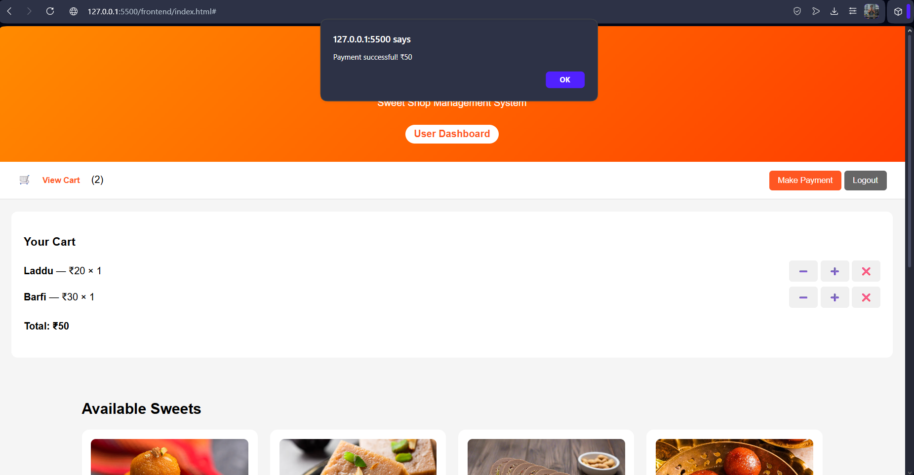
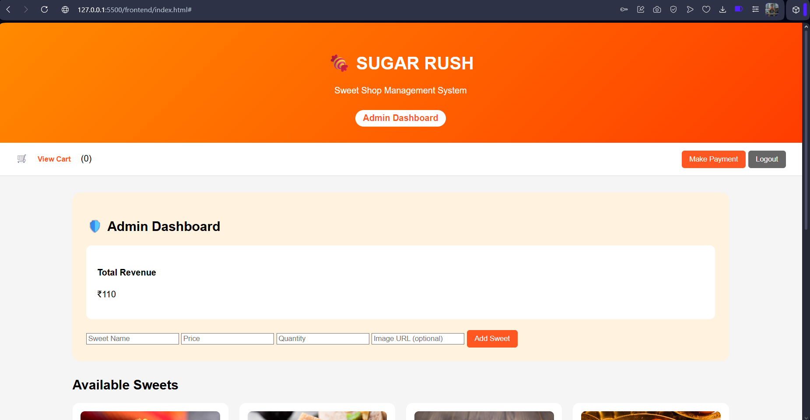
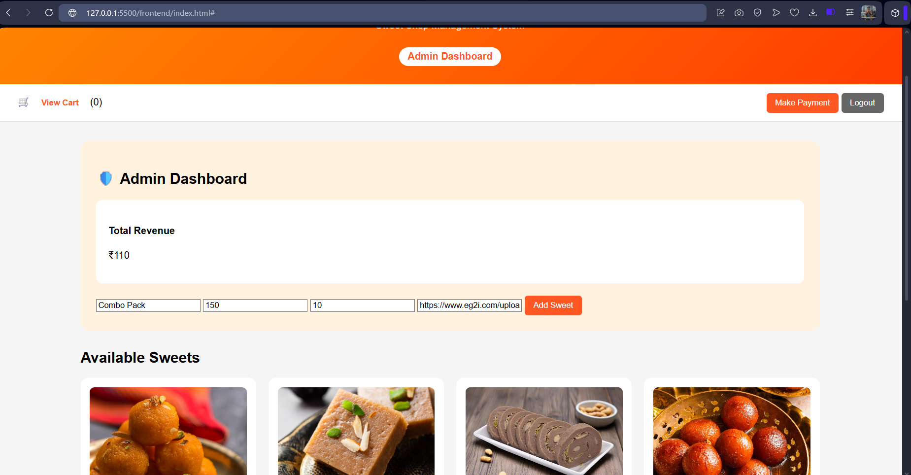
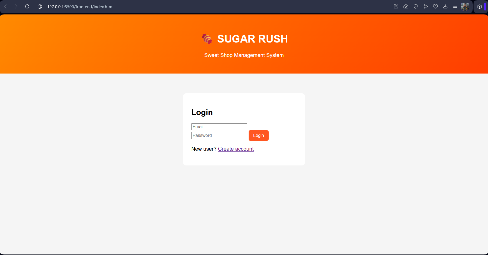
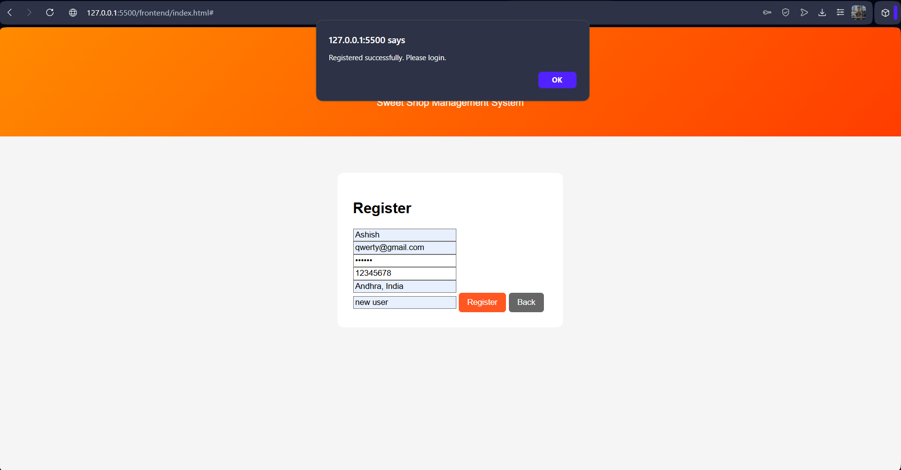

# 🍬 Sugar Rush - Sweet Shop Management System

Sugar Rush is a full-stack Sweet Shop Management System built as part of a TDD kata assignment. The project supports user and admin authentication, sweet inventory management, purchasing, and admin revenue tracking.

The **backend** is implemented using Node.js, Express, and MongoDB, and the **frontend** is a lightweight vanilla HTML/CSS/JavaScript SPA that interacts with the backend through REST APIs.

---

## Features

### 👤 User Features

- User registration and login (JWT authentication)
- Browse available sweets with images
- Add sweets to cart
- Increase, decrease, or remove items from cart
- Make checkout with confirmation popup

### 🛡️ Admin Features

- Admin login
- Add new sweets (name, price, quantity, image)
- View total revenue generated from purchases
- Role-based access control (admin-only routes)

---

## 🛠 Tech Stack

### Backend

- Node.js
- Express.js
- MongoDB (Atlas)
- Mongoose
- JWT (JSON Web Token)
- bcrypt

### Frontend

- HTML
- CSS
- Vanilla JavaScript (Fetch API)

### Tools & Utilities

- MongoDB Compass
- Postman
- Git & GitHub

---

## 🔐 Authentication & Authorization

- JWT tokens are issued upon successful login
- Protected API routes require a valid token
- Role-based middleware restricts admin-only functionality
- Supported user roles:
  - `client`
  - `admin`

---

## 🗄 Database Design

### Users Collection

- `userName`
- `email`
- `password` (hashed)
- `phone`
- `address`
- `usertype` (client/admin)
- `answer` (security question)

### Sweets Collection

- `name`
- `price`
- `quantity`
- `image`

---

## API Testing (Postman) - [](screenshots/Postman-Testing.png)

All backend APIs were thoroughly tested using **Postman** before frontend integration.  
This helped validate business logic, authentication, authorization, and error handling in isolation.

### 🔹 Authentication APIs

#### User / Admin Registration

- **Endpoint:** `POST /api/v1/auth/register`
- **Tested Scenarios:**
  - Successful registration
  - Duplicate email validation
  - Missing required fields
- **Result:** User saved with hashed password in MongoDB

#### Login

- **Endpoint:** `POST /api/v1/auth/login`
- **Tested Scenarios:**
  - Valid credentials → JWT token generated
  - Invalid password → error response
- **Result:** Token returned and used for protected routes

---

### 🔹 User APIs

#### Get User Profile

- **Endpoint:** `GET /api/v1/user/getUser`
- **Authorization:** Bearer Token
- **Validation:** Unauthorized access blocked

#### Update User

- **Endpoint:** `PUT /api/v1/user/updateUser`
- **Fields Tested:** name, phone, address

#### Password Reset

- **Endpoint:** `POST /api/v1/user/resetPassword`
- **Validation:** Security answer verification

---

### 🔹 Sweet APIs

#### Get All Sweets

- **Endpoint:** `GET /api/v1/sweets`
- **Result:** Returns list of sweets with price, quantity, image

#### Add Sweet (Admin Only)

- **Endpoint:** `POST /api/v1/sweets`
- **Authorization:** Admin JWT required
- **Tested Scenarios:**
  - Admin access → success
  - User access → forbidden

---

### 🔹 Cart & Checkout APIs

#### Checkout

- **Endpoint:** `POST /api/v1/checkout`
- **Authorization:** Bearer Token
- **Payload:** Total cart amount
- **Result:** Make payment processed successfully

---

### 🔹 Admin APIs

#### Get Total Revenue

- **Endpoint:** `GET /api/v1/admin/revenue`
- **Authorization:** Admin JWT
- **Result:** Returns cumulative revenue from all payments

### Testing Approach

- APIs were tested **independently before frontend**
- Edge cases and authorization failures were verified
- Postman ensured correctness before UI integration

This testing-first approach helped reduce frontend bugs and ensured reliable backend behavior.

---

## ▶️ Running the Project Locally

## 📸 User Screenshots

### 🏠 User Home Page

[](screenshots/User-HomePage.png)

- Displays all available sweets with images, prices, and quantity
- Users can add items to the cart

### 🛒 User Cart Page

[](screenshots/User-CartPage.png)

- Shows cart items
- Quantity controls (+ / −)
- Remove item option

### 💳 Proceed with Payment

[](screenshots/Proceed-with-payment.png)

- Confirmation popup before payment

### ✅ Payment Successful

[](screenshots/Payment-Successful.png)

- Displays payment success message
- Updates admin revenue

## 🛡️ Admin Screenshots

### 📊 Admin Dashboard

[](screenshots/Admin-Dashboard.png)

- Admin overview dashboard
- Displays total revenue

### ➕ Add Sweets

[](screenshots/Add-Sweets.png)

- Admin can add sweets with price, quantity, and image URL

### 💰 Revenue Generated by Admin

[](screenshots/Revenue-genterated-by-the-Admin.png)

- Revenue updates after each successful payment

### 🧾 User Registration Page

[](screenshots/registration.png)

- User registration form

### ✅ Registration Successful

[](screenshots/Registration-Successful.png)

- Confirmation after successful registration

### 🔐 Backend Registration Validation

[](screenshots/Registration-Validation-at-the-backend.png)

- Backend validation and error handling

---

## My AI Usage

### AI Tools Used

- ChatGPT

### How I Used AI

- Designed frontend UI and cart management
- Implemented admin revenue logic
- Debugged frontend-backend integration
- Improved UI/UX flow
- Helped structure and write documentation

### Reflection

AI significantly improved my productivity by accelerating development, assisting in debugging, and refining user experience. I used AI responsibly as a support tool while maintaining full understanding and ownership of the code.

---

## How to Run Locally

### Backend

```bash
cd backend
npm install
npm start
```

### Frontend

```bash
cd frontend
open index.html
```

---

Cheers,
Ashish Pragada
